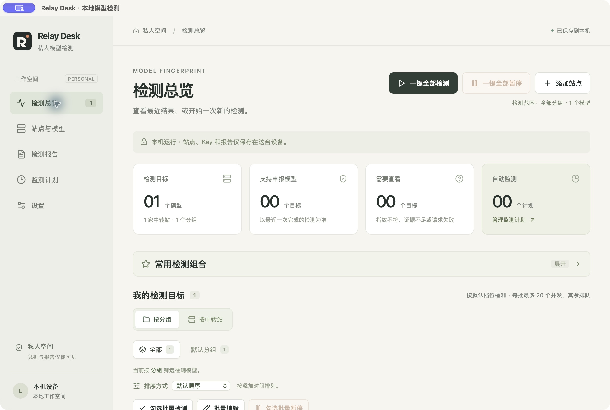
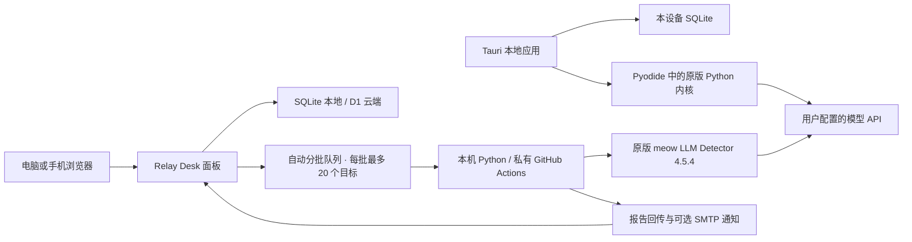

<p align="center"></p>

# Relay Desk · 私人模型检测面板

面向个人使用的模型行为指纹检测与监测工作台。把多个中转站、多个 API Key、GPT / Claude 模型、定时监测和历史报告集中管理，提供本地应用与网页部署两种运行方式。

**面板设计与集成维护：[nethyzz](https://github.com/nethyzz)**  
**检测内核原作者：[chen-006](https://github.com/chen-006) 及上游贡献者**  
**原项目：[meow LLM Detector](https://github.com/chen-006/meow-llm-detector)，固定内核版本 4.5.4**

Relay Desk 提供界面、配置管理、任务调度、预算控制与通知；检测与评分由未修改的原版 meow 内核执行。原作者的算法、基准和贡献归属保持不变。内核提交、基准版本与 SHA-256 均锁定在 [runner/upstream.json](runner/upstream.json)。

> 检测结果是模型行为的指纹证据。匹配百分比不能解释为「降智百分比」、身份概率或服务可用率；它也不能单独证明服务商故意替换了模型。

[下载软件](#下载与安装本地应用) · [源码快速开始](#快速开始) · [使用指南](docs/USAGE.md) · [应用安装与备份](docs/cross-platform-apps.md) · [云端部署](docs/DEPLOYMENT.md) · [原作者与第三方声明](THIRD_PARTY_NOTICES.md)

当前发布：[v1.3.0 · 本地应用](https://github.com/nethyzz/relay-desk-public/releases/tag/v1.3.0)。本次公开源码版本为 1.3.0，随附已在本机制作并验证的本地应用 1.1.0；两者分别编号。原有网页模式继续提供，更新记录见 [CHANGELOG.md](CHANGELOG.md)。

## 下载与安装本地应用

**直接使用软件无需安装 Python、Node、Rust，也无需配置 Cloudflare 或 GitHub 后台。** 界面、原版 Python 检测引擎和 SQLite 随安装包提供；站点、Key、报告和设置保存到本设备，检测直接连接自己的模型 API。

| 下载 | 适用范围 |
| --- | --- |
| [Mac 安装包（DMG，推荐）](https://github.com/nethyzz/relay-desk-public/releases/download/v1.3.0/Relay-Desk-1.1.0-macos-arm64.dmg) | Apple Silicon Mac（M 系列），macOS 13.3 或更新版本 |
| [Mac 应用 ZIP](https://github.com/nethyzz/relay-desk-public/releases/download/v1.3.0/Relay-Desk-1.1.0-macos-arm64.app.zip) | 与 DMG 相同的应用，可解压后放入“应用程序” |
| [共享应用源码与离线运行资源](https://github.com/nethyzz/relay-desk-public/releases/download/v1.3.0/relay-desk-v1.3.0-native-source.zip) | 面向开发者；Windows、Android、iPhone 尚未交付安装包 |

1. 下载 DMG，打开后将 Relay Desk 拖入“应用程序”，再启动应用。
2. 在「站点与模型」添加自己的 HTTPS API 地址、Key 和检测模型，再在总览发起检测。
3. 在「设置 → 本机数据与备份」导出密码加密的备份；跨设备迁移需手动恢复，网页端数据不会自动迁入 App。

本包使用 ad-hoc 签名，尚未完成 Developer ID 签名和 Apple 公证。系统若阻止首次打开，请核对下载来源与 SHA-256，并按系统「隐私与安全性」提示操作。安装、备份、数据目录和卸载步骤见 [本地应用指南](docs/cross-platform-apps.md)；下载校验值随 Release 提供。

随附 [第三方许可包](https://github.com/nethyzz/relay-desk-public/releases/download/v1.3.0/THIRD_PARTY_LICENSES.zip) 保留原作者与依赖声明。软件包含 chen-006 及贡献者的 meow 4.5.4 原版内核，按 PolyForm Noncommercial 1.0.0 用于个人非商业使用。

**自动监测需要应用保持打开；手机检测需要保持前台。** 退出、休眠或系统终止后不保证继续执行。Windows、Android 和 iPhone / iPad 当前提供共享工程与构建说明，尚未完成相应平台的安装与真机验证。



## 程序介绍

| 功能 | 说明 |
| --- | --- |
| 多站点与多 Key | 同一中转站可保存多条独立 Key，各自管理分组和模型 |
| 配置删除 | 预览后删除中转站、Key 或模型，清理关联监测与组合，保留历史报告 |
| 四种 API 协议 | GPT Responses、GPT Chat 兼容、Claude Messages、Claude Chat 兼容 |
| 单次与批量检测 | 可提交整个筛选范围或任意组合，自动拆分为每批最多 20 个目标，按队列依次执行 |
| 暂停检测 | 支持单个目标、当前范围或勾选目标暂停，执行器确认后保留已完成样本 |
| 常用检测组合 | 保存跨分组、跨中转站的模型组合，多设备登录后复用 |
| 批量编辑 | 预览后统一修改协议、申报模型、请求别名和手动默认档位 |
| 定时监测 | 支持间隔或每日计划，保留每次检测使用的配置与基准快照 |
| 报告与诊断 | 总览使用报告摘要，完整样本按需加载；保留三类结论、错误诊断与 JSON 导出 |
| 邮件通知 | QQ 邮箱 / SMTP，异常与恢复、每日汇总、每轮汇总及手动检测通知 |
| 预算管理 | 请求数与 runner 分钟限额、并发任务复用、请求与重试预留 |
| 私人访问 | 云端邮箱密码登录、凭据加密、报告登录可见、移动端 PWA |

本地应用使用 Tauri、Pyodide 和 SQLite 在设备上运行；源码网页预览使用 Node.js API、SQLite 与本机 Python 执行器；云端模式使用 Cloudflare Workers + D1，以及你自己拥有的私有 GitHub Actions 执行仓库。云端数据在登录设备间共享，本地应用通过加密备份手动迁移。



## 快速开始

需要 **Node.js 22.13+** 与 **Python 3.11+**。建议使用 Node.js 22 和 Python 3.12；本地脚本适用于 macOS / Linux，Windows 可在 WSL2 中运行。首次安装需能访问 npm、Python 包源和 GitHub。

```bash
git clone https://github.com/nethyzz/relay-desk-public.git
cd relay-desk-public
npm ci
npm run setup:local
npm run dev
```

浏览器打开 **http://127.0.0.1:5173**。本地模式无需 Cloudflare 或 GitHub 登录，API 仅监听本机 `127.0.0.1`。

若需要 HTTP 代理下载内核，将安装步骤替换为：

```bash
npm run setup:local -- --proxy http://127.0.0.1:你的代理端口
```

若 Python 没有被自动找到，可先设置 `RELAY_PYTHON` 为 Python 3.11+ 的可执行文件路径。安装会在 `.venv/` 创建独立环境，并在 `.vendor/` 下载、校验固定内核和六套基准。

首次检测：

1. 进入「站点与模型」，新增中转站，填写自己的公网 HTTPS API 地址和 Key。
2. 添加模型，选择协议与「希望验证的模型」，填写服务商实际接受的请求模型名；也可获取模型列表后选择。
3. 选择快速、标准或深度档位，再发起检测。GPT 当前基准推荐深度档 128 次；快速档适合先检查配置和连接。
4. 在总览查看进度，打开报告查看结论、判定线和有效样本。真实请求费用由自己的模型 API 账户承担。

可以一次提交超过 20 个模型；后台会分批执行，并在整个选择完成后汇总通知。应用不再设固定的目标数量上限，实际规模仍受平台存储与请求容量约束。暂停本次任务后，已有证据保留；再次检测会从头开始，后续定时监测计划不受影响。

在「站点与模型」或对应编辑窗口中可删除不再使用的配置。确认窗口会列出受影响的 Key、模型和监测计划；正在检测的目标需要先停止并等待结束。删除配置后历史报告仍可查看、导出。

本地数据保存在 `.local/panel.sqlite`；解密主密钥保存在 `.local/secrets.json`。**备份和迁移时一起保留这两个文件**，不要把它们提交到 GitHub。

## 云端部署

这个公开仓库用于分发源码。云端执行器要求使用**你自己拥有的私有仓库**，配置脚本会核验所有者、仓库 ID、默认分支与 OIDC 身份。

1. 将本项目源码推送到自己的私有执行仓库。
2. 登录 GitHub CLI 与 Wrangler，运行 `npm run configure` 创建自己的 D1 数据库并填写部署配置。
3. 配置邮箱密码登录和仅限该私有仓库的 Actions token。
4. 运行部署和远程验证，登录面板后完成一次真实检测。

完整命令、权限、备份和迁移步骤见 **[云端部署指南](docs/DEPLOYMENT.md)**。发布版本中的 `wrangler.jsonc` 全部使用占位符；请使用自己的账户与数据库配置。

## 支持的基准与模型

以下是本次发布固定的候选列表，具体信息以 [配置清单](runner/upstream.json) 和 [模型映射](src/shared.ts) 为准。

| 协议 | 固定基准 | 候选模型 | 快速 / 标准 / 深度 |
| --- | --- | --- | --- |
| GPT Responses / Chat 兼容 | `20261003.1` | GPT 6.1 Sol、6 Astra、5.6 Terra、6 Luna | 32 / 64 / 128 |
| Claude Messages / Chat 兼容 | `20260924.1` | Fable 5.1、Opus 5.5、Sonnet 5、Haiku 4.5 | 48 / 72 / 120 |
| GPT 6 Sol 保留基准 | `20260924.2` | GPT 6 Sol | 32 / 64 / 128 |

次数为计划采样次数；最大请求预留还包含约 50% 的重试预算。GPT 6.1 Sol 与 Astra 在 32 / 64 次时可能难以区分，上游推荐使用 128 次。未收录的模型可保存配置，但暂不支持判定。

## 开发与验证

```bash
npm test
npm run test:python
npm run build
```

Python 对照测试使用合成响应，比对适配层与原版内核；不调用真实模型 API，也不消耗模型账户额度。GitHub CI 执行安装、固定内核校验、TypeScript 测试、Python 对照测试和生产构建。

应用开发还需要 Rust 1.89+ 和目标平台 SDK，详见 [应用构建说明](docs/cross-platform-apps.md#构建和清理)。首次准备可运行 `npm run upstream:install`，随后使用：

```bash
npm run app:doctor
npm run app:verify
npm run app:build
```

`app:verify` 使用合成响应核对原版 Python 与 WASM 的检测结果、协议传输、取消和 SQLite 保存恢复。GitHub CI 还验证应用前端与 macOS Rust 原生测试；这不代表已完成其他平台的设备测试。

| 目录 | 内容 |
| --- | --- |
| `src/`、`public/` | React 界面、移动端资源与图标 |
| `worker/`、`migrations/` | Worker API、鉴权、加密与数据库迁移 |
| `runner/` | 原版内核的执行与邮件适配层、上游版本清单 |
| `apps/local/`、`src-tauri/` | 设备上的 Python / WASM 适配、备份与 Tauri 原生工程 |
| `scripts/` | 本地启动、内核下载、部署与迁移脚本 |
| `tests/` | 行为、鉴权、批量操作、调度和原版内核对照测试 |
| `docs/` | 使用、本地应用安装与云端部署文档 |

`npm run deploy:check` 用于已经填写部署参数的目录；公开模板含占位符，尚未配置时该检查会提示部署条件未满足。

## 署名与许可证

Relay Desk 面板与集成代码由 [nethyzz](https://github.com/nethyzz) 维护；**模型检测、评分内核与官方基准由 [chen-006 及贡献者](https://github.com/chen-006/meow-llm-detector) 提供**。面板调用原版 Python 内核，未实现替代评分算法，也未将原内核署名改为面板作者。

本项目公开源码采用 **PolyForm Noncommercial License 1.0.0**，见 [LICENSE](LICENSE)；原内核许可证原文见 [LICENSES/meow-llm-detector.txt](LICENSES/meow-llm-detector.txt)。这是有非商业用途限制的许可证，公开源码不代表可无条件商用。第三方依赖分别遵守其原许可证。相关声明与上游致谢见 [THIRD_PARTY_NOTICES.md](THIRD_PARTY_NOTICES.md)。

Required Notice: Copyright 2026 chen-006 and contributors. Original project: https://github.com/chen-006/gpt56_api_detector

如需反馈问题，请提交 [Issue](https://github.com/nethyzz/relay-desk-public/issues)，附版本、协议与脱敏后的错误信息。
